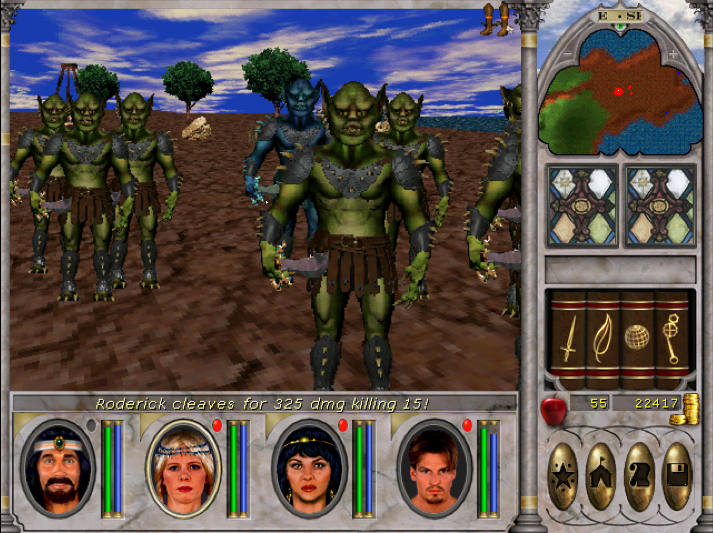
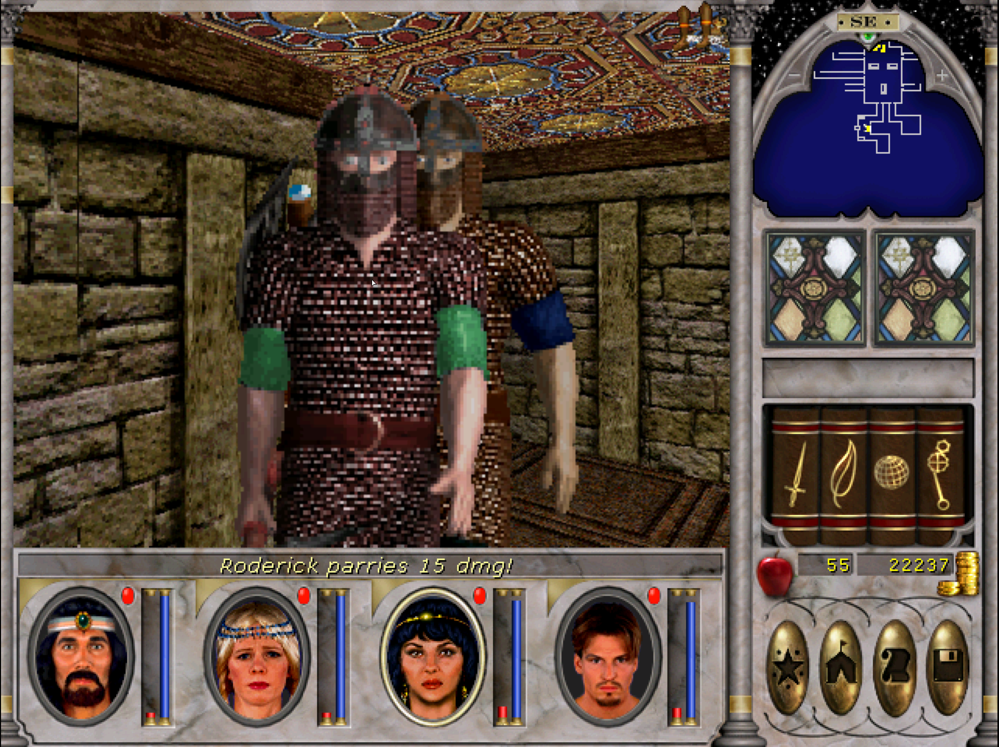
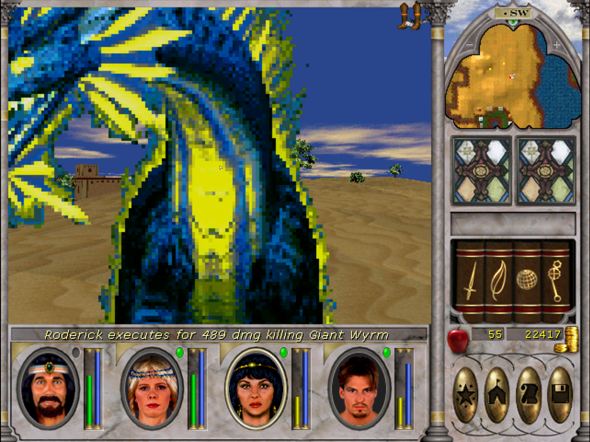
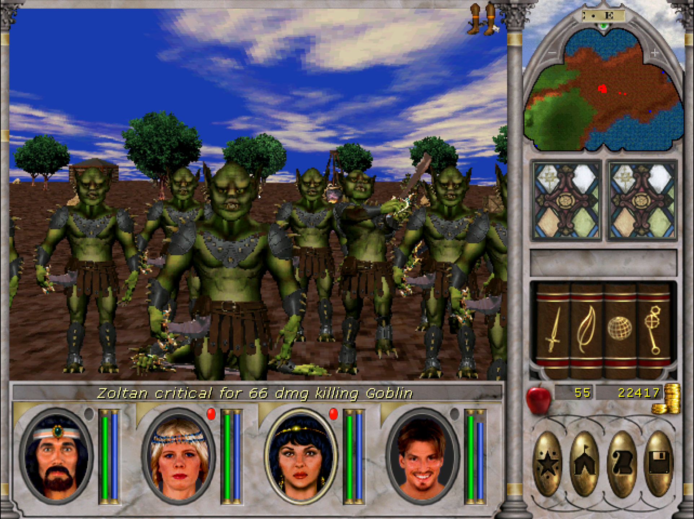
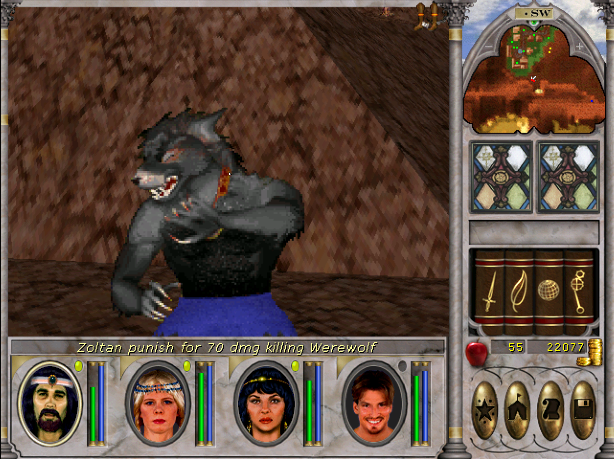
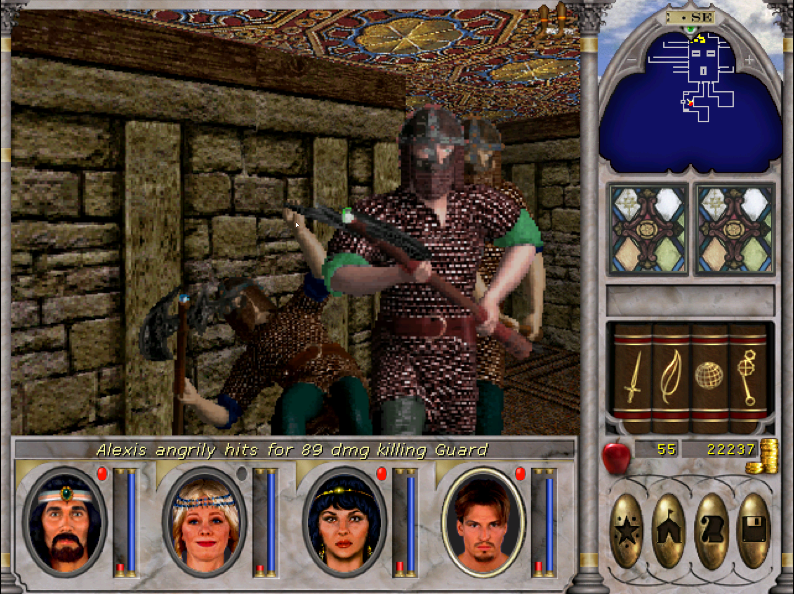
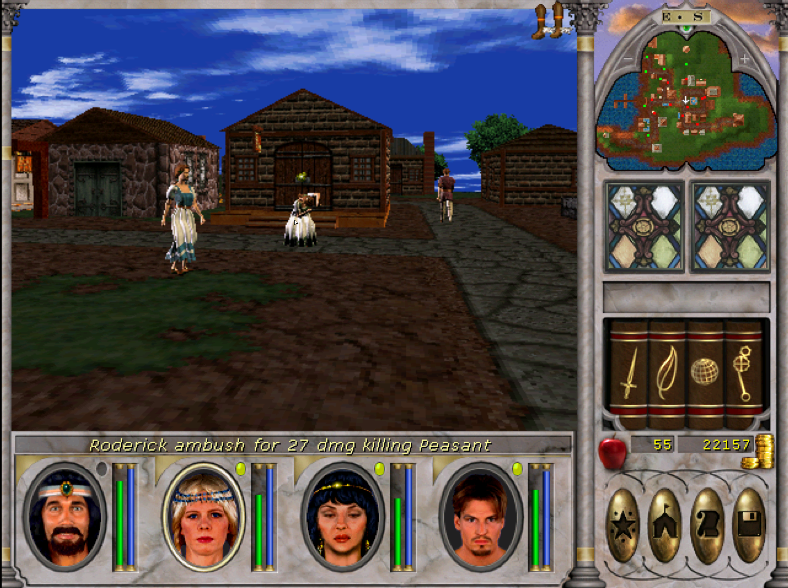
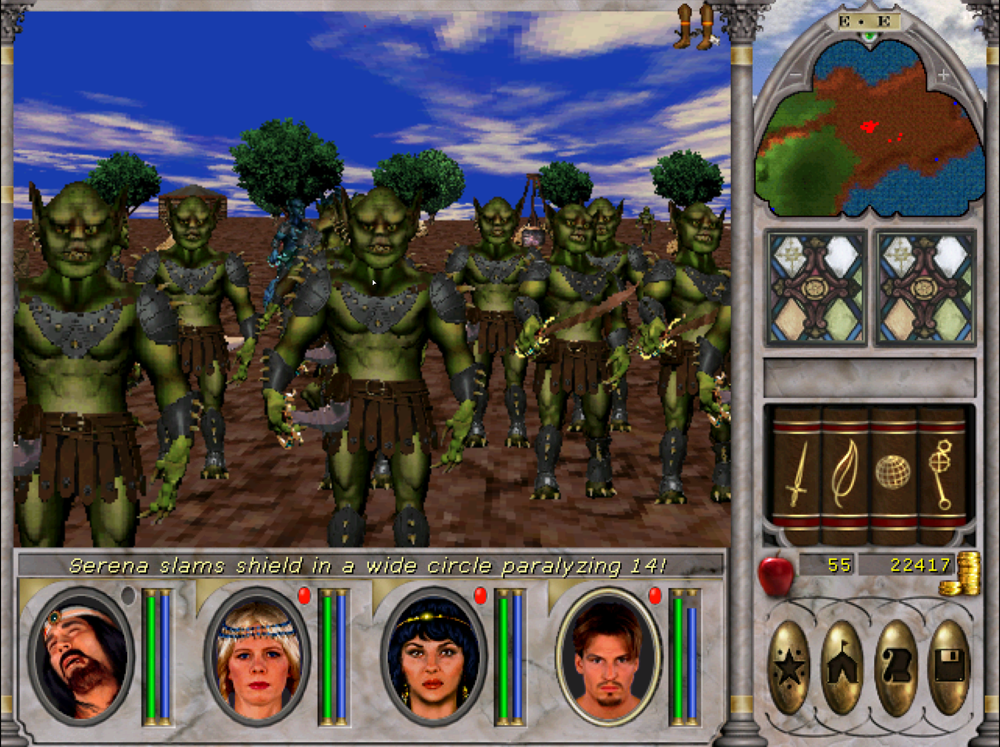

# Might and Magic 6 Weapon effects

This is an improved port of my mod [MMMerge Weapon Effects](https://github.com/v1kt0r1337/MMMerge-Weapon-Effects) a mod which was made with Might and Magic VI in mind.

## Purpose
The purpose of this mod is to give the weapon types a more disctinct feel, and make might more on par with offensive magic.
By using the default loadout every melee weapon type a different effect attached to it. There is also an extra effect attached to 2-Handed weapons.  
I also wanted to make this mod flexible, you can attach whatever combination of weapon effects you want to a single weapon type, and attach different requirements for each weapon effect.
The mod distinguish between effects that happens when the player hits a monster and effects that happens when a monster hits a player. Some effects like cleave can be used both circumstances.

## Getting started
This mod requires the unreleased [MMExtension v2.3](https://github.com/GrayFace/MMExtension)
MMExtension v2.3 requires [GrayFace patch version 2.1+](https://grayface.github.io/mm/#GrayFace-MM6-Patch), I'd recommend picking the latest version.

This mod comes in two versions, standalone and [bundled with MMExtension v2.3](https://drive.google.com/file/d/1P68IuJVT6kR8y7NvgGHyDJz18KT_xyvH/view?usp=share_link).

### Standalone
If you already got mods that are using MMExtension v2.3 you can pick the standalone version. 
Copy the WeaponEffects.lua file into Scripts\Global folder.
Your folder path might look something like ```C:\Program Files (x86)\GOG Galaxy\Games\Might and Magic 8\Scripts\Global```

### Bundled with MMExtension v2.3
Extract MM6_Weapon_Effects.rar directly into your Might and Magic 8 folder.
Your folder path might look something like ```C:\Program Files (x86)\GOG Galaxy\Games\Might and Magic 8```


## Table of Contents
- [General mechanics](#general-mechanics)
    - [How it works (short version)](#how-it-works-(short-version))
- [Default loadout (short version)](#default-loadout-(short-version))
    - [Axe](#axe)
    - [Sword](#sword)
    - [Dagger](#dagger)
    - [Mace](#mace)
    - [Staff](#staff)
    - [Spear](#spear)
    - [Bow and blaster](#bow-and-blaster)
    - [Shield](#shield)
- [Weapon effect fields](#weapon-effect-fields)
- [Weapon effects required fields](#weapon-effects-required-fields)
- [Damage calculations](#damage-calculations)
- [Unused effects](#unused-effects)
- [Detailed mechanics](#detailed-mechanics)
- [Bonus (damage tracker)](#bonus)
- [Special thanks](#special-thanks)


## General mechanics
This mod does not in anyway remove or overwrite the original mechanics unlocked throught skill mastery. 
This mod adds additional effects to the physical combat skills of your player. 

#### How it works (short version)
When a player attacks or get attacked the mod checks the player's hands and bow slot and extract the active skills. When player performs a melee attack only the hand slots will be used, if the player uses a bow/crossbow only the bow slot will be used. If a player is attacked all three slots will be checked. 

All of the active slots can proc effects, and if two of these slots provide the same effect the effect can proc twice. For example with the default loadout daggers get additional crit chance. If the player dual wields dagger then there will be seperate calculation for each hand with the potential that both crits in the same attack. Damage effects like these will stack into a single burst of damage.

As mentioned there are two categories of effects, effects that trigger when players hits a monster and effects that trigger when a monster hits the player. 
Some weapon effects can only be used in one of these contexts while others can be used in both contexts: AN OVERVIEW OF THESE CAN BE SEEN LINK.

## Damage calculation
Most weapon effects that deal bonus damage will do weapon damage.

Weapon damage:
- Weapons dice damage + damage modifier. If weapon has 2d3 + 4 it will do 6-10 damage.

In addition the multiplier field is used. A multiplier of 1 will leave the damage unchanged, a multiplier of 2 will double the damage and a multiplier of 0.5 will halve the damage. For more about multiplier see [Multiplier - wefMultiplier](#multiplier-wefmultiplier)

## Default loadout (short version)
To interpret fields like Chance (1) see [Weapon effect fields](#weapon-effect-fields).

#### Axe
##### 1-handed weapons: 
- Chance (1) of cleaving all surrounding monster on hit (Multiplier 1).
##### 2-handed weapons: 
- Chance (1) of cleaving all surrounding monster on hit (Multiplier 1).
- Chance (0.8) of cleaving all surrounding monster when player is hit (Multiplier 1).


#### Sword
##### 1-handed weapons: 
- Chance (1) to parry incoming damage (Multiplier 0).


##### 2-handed weapons: 
- Chance (1) to parry incoming damage (Multiplier 0).
- Chance (0.5) to decapitate (instant kill) on hit


#### Dagger
- Additional chance (1) to crit for a more substantial amount of damage (Multiplier 2)


#### Mace
- Deals additional damage on monsters that are stunned or paralyzed (Multiplier 2)


#### Staff
- Extra damage when monster is below 50% hp (Multiplier 5)


#### Spear
- Extra damage when player is below 75% hp. The damage will increase the lower the players hp is. The formula is Multiplier - HP /FullHP (Multiplier 2)

###### Used 2-handed or with shield
- Extra damage when player is below 75% hp. The damage will increase the lower the players hp is. The formula is Multiplier - HP /FullHP (Multiplier 2)
- True damage, passes physical damage reduction as long as the monster is not immune to physical damage


#### Bow and blaster
- Ambush effect which gives extra damage to unaware monsters with full hp that are not in watch mode, unfortunately in mm6 this only seem to work on peasants.
- As an improved visual effect the damage from the extra arrow unlocked at master is added to the first arrow (if both hit) when displaying the damage.


#### Shield
- Chance to stun all surrounding monster when player is hit



## Weapon effect fields
#### Chance - wefChance
Chance is a modifier that determines how big chance the effect has to proc.
The calculation is done in two different ways depending on if the chance modifier is less or greater then 1.

Chance is 1 or greater:
- Skill * Chance + Luck bonus

Chance is smaller then 1:
- (Skill + Luck bonus) * Chance

Use GrayFace stats mechanic as reference to calculate Luck bonus from Luck
https://grayface.github.io/mm/mechanics/#Statistics

Lets see how it works in practise:
A player with sword skill of 12 and 60 luck (+9 bonus) 

If the chance is 1:
12 * 1 + 9 = 21% chance of success
If the chance is 1.5:
12 * 1.5 + 9 = 27% chance of success
However if the chance is 0.5:
(12 + 9) * 0.5 =  10.5% chance of success

#### Multiplier - wefMultiplier
Multiplier changes the power of the effect. If it is a damage bonus the damage will be multiplied with the multiplier, if it is a damage reduction like block/parry then the multiplier will be used on the incoming damage.
If the resulting damage is a decimal number it will be floored to the nearest whole number.

How it works in practise:
11 damage with a multiplier of 2 will become 22 damage, but with a multiplier of 0.1 it will become 2.2 damage which will be floored to 2 damage. That means if you change the multiplier on weBlock to a greater number than 1 then a successfull block/parry will actually increase the damage taken! 

#### Duration - wefDuration
Duration is how long an effect will last, by giving an effect a duration of 1 it will last 1 game minute. If played in real time 1 game minute last approximately 2 seconds.
If you want the duration to last 1 second simply set duration to 0.5.

#### AIState - wefAIState
AIState is the state of the targeted monster. The state can be anything from stunned, dead, standing or attacking in melee. The different states can be found here: https://grayface.github.io/mm/ext/ref/#const.AIState

#### Power - wefPower
Power is used in when applying buff or debuff and determines what power that is applyed.
List of offensive powers: https://grayface.github.io/mm/ext/ref/#const.MonsterBuff
List of defensive powers (not implemented): https://grayface.github.io/mm/ext/ref/#const.PartyBuff and https://grayface.github.io/mm/ext/ref/#const.PlayerBuff

#### Lower Threshold - wefLowerThreshold
Used by effects like extra damage to monster when monster or players is between a certain damage threshold. 
Lower Threshold is inclusive, in the examples above one of the requirements for extra damage is that HP is equal or above the lower threshold.
If lower threshold is 0.5 then HP needs to be equal or above 50%, if lower threshold is 0 then the criteria is automatically achieved


#### Higher Threshold - wefHigherThreshold
Used by effects like extra damage to monster when monster or players is between a certain damage threshold. 
Higher Threshold is inclusive, in the examples above one of the requirements for extra damage is that HP is equal or below the higher threshold.
If higher threshold is 0.5 then HP needs to be equal or below 50%, if higher threshold is 1 then the criteria is automatically achieved.


#### Scale - wefScale
Used by weExtraDamageWhenPlayerCondition. If set to scaleWithLowHP it will deal additonal damage the lower the players HP/FullHP ratio is, if set to scaleWithHighHP it will deal additional damage the higher the HP/FullHP ratio is.


## Weapon effects required fields

#### Ambush - weAmbush
- Multiplier - wefMultiplier

#### Block - weBlock
- Chance - wefChance
- Multiplier - wefMultiplier

#### Instant kill - weInstantKill
- Chance - wefChance

#### Crit - weCrit
- Chance - wefChance
- Multiplier - wefMultiplier

#### Greater cleave - weGreaterCleave
- Chance - wefChance
- Multiplier - wefMultiplier

#### True damage - weTrueDamage
- Chance - wefChance

#### Extra damage on monster condition - weExtraDamageOnMonsterCondition
- AIState - wefAIState
- Multiplier - wefMultiplier
- Chance - wefChance

#### Extra damage when monster HP is in threshold - weExtraDamageWhenMonsterHPThreshold
- Chance - wefChance
- Lower Threshold - wefLowerThreshold
- Higher Threshold - wefHigherThreshold
- Multiplier - wefMultiplier

#### Extra damage when player HP is in threshold - weExtraDamageWhenPlayerHPThreshold
- Chance - wefChance
- Lower Threshold - wefLowerThreshold
- Higher Threshold - wefHigherThreshold
- Multiplier - wefMultiplier
- Scale - wefScale (optional)

#### Apply monster buff - weApplyMonsterBuff
- Chance - wefChance
- Duration - wefDuration 
- Power - wefPower -- https://grayface.github.io/mm/ext/ref/#const.MonsterBuff

#### Apply monster buff on all hostiles in melee range - weApplyMonsterBuffOnAllInMeleeRange
- Chance - wefChance
- Duration - wefDuration 
- Power - wefPower -- https://grayface.github.io/mm/ext/ref/#const.MonsterBuff

## Weapon effect requirements
Requirements are always optional..
Default loadout requires Master to unlock all new weapon effects except for ambush.

#### Mastery - wefMastery
Mastery is the most common effect requirement and is based on the skill mastery of the skill used by the weapon/shield the effect is attached to.
The value in mastery is the minimum requirement for being able to activate the effect, if Mastery is Master both Master and Master will satisfy the requirement.
In default loadout all effects except ambush got Master as a requirement.
Valid values are: (https://grayface.github.io/mm/ext/ref/#const)
- const.Novice
- const.Expert
- const.Master	

#### Extra requirements (weFieldsExtraReqs)
Inside extra requirements we can set additional requirements
##### reqsOtherHand
This can contain one or multiple different equipable skills. To meet the requirement the player needs to one of these skills to be active on the other hand

## Unused effects
- Add debuff like stun, paralyze etc... to monster when hit
- Other HP threshold variations extra damage when player or monster hp is between a certain threshold. For example it is fully possible to add extra dmg to monster with full or above 50% HP.


## Detailed mechanics 

The weapon effects follows the following structure:

```
Weapon
    1Handed
        onHitMonster
            weapon effect procced when monster is hit
                fields
                extra Requirements
                    an extra requirement    
        onHitPlayer
            weapon effect procced when player is hit
                weapon effect procced when monster is hit
                fields
                extra Requirements
                    an extra requirement    
    2Handed
        onHitMonster
            weapon effect procced when monster is hit
                fields
                extra Requirements
                    an extra requirement    
            
        onHitPlayer
            weapon effect procced when player is hit
                weapon effect procced when monster is hit
                fields
                extra Requirements
                    an extra requirement    
```
Code example 
- Constants prefixed with const is found here https://grayface.github.io/mm/ext/ref/#Constants
- Other constants are defined in WeaponEffects.lua 
```lua
local weaponEffects = {
    [const.Skills.Sword] = {
        [const.ItemType.Weapon - 1] = {
            [onHitMonster] =  {
                [weAmbush] = {
                    [weFieldsMultiplier] = defaultAmbushMultiplier
                }
            },
            [onHitPlayer] = {
                [weBlock] = {
                    [weFieldsChance] = 1,
                    -- damageFactor of 0 completely negates all damage, 
                    [weFieldsMultiplier] = 0,
                    [weFieldsMastery] = const.Master
                }
            }
        },
        [const.ItemType.Weapon2H - 1] = {
            [onHitMonster] = {
                [weAmbush] = {
                    [weFieldsMultiplier] = defaultAmbushMultiplier
                },
                [weInstantKill] = {
                    [weFieldsChance] = 0.5,
                    [weFieldsMastery] = const.Master
                }
            },
            [onHitPlayer] = {
                [weBlock] = {
                    [weFieldsChance] = 1,
                    -- damageFactor of 0 completely negates all damage, 
                    [weFieldsMultiplier] = 0,
                    [weFieldsMastery] = const.Master
                }
            }
        }
    }
    --- in reality all weapon types needs to be present not just sword
}
```

```
-- local struct.extraReqs = {
--     reqsMasteriesOr = { -- Only one of these mastery reqs must be met
--          --[[ 
--         [const.Skills.Sword] = const.Master,
--         [const.Skills.Staff] = const.Master    
--          --]]
--     }, 
--     otherHand = { -- Skill type used by other hand, only one of these reqs must be met 
--         --[[ 
--             [const.Skills.Shield] = true,
--             ["Unarmed"] = true   
--         --]]
--     }

    -- Not implemented
    -- masteriesAnd = { -- All these mastery reqs must be met
    --  --[[ 
    --     [const.Skills.Sword] = const.Master,
    --     [const.Skills.Staff] = const.Master    
    -- --]]
    -- },
    -- skillsOr = { -- Only one of these skill points reqs must be met
    --  --[[ 
    --     [const.Skills.Sword] = 7 
    -- --]]
    -- },
    -- skillsAnd = { -- All of these skill reqs must be met

    -- },
    -- raceOr = {  -- Passes as long as player race is one of these races
    --     --[[
    --         [const.Race.Elf] = true
    --     --]]
    -- }
-- }
```

## Bonus
Check the damage performance of your party members!
Click Ctrl + F1 to open the console, type ```showDamage()``` and click Ctrl + Enter


## Special thanks
For Lua and MMExtension tips!
- [CognizanceGaming](https://github.com/czgaming94)
- [cthscr](https://gitlab.com/cthscr)
- [GrayFace](https://github.com/GrayFace)
